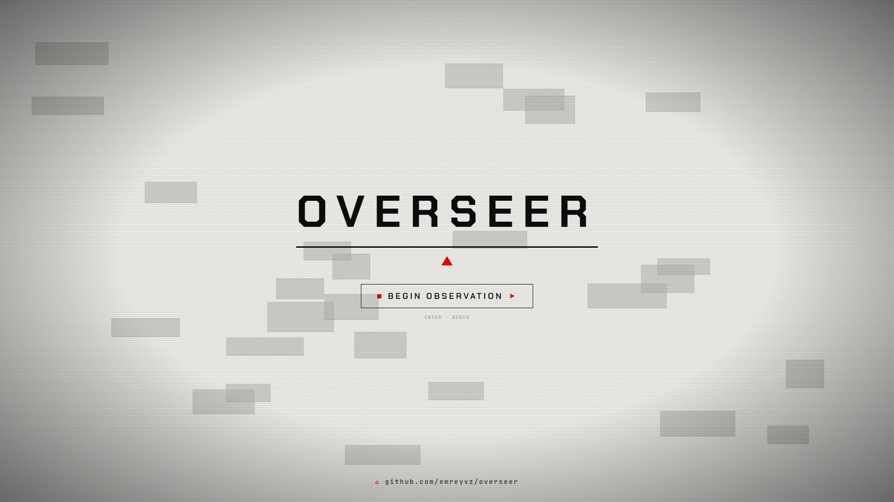

# overseer

**See more. Know sooner. Miss nothing.**

overseer turns any set of cameras into a single real time intelligence operation. It spots people, vehicles, weapons and dangerous behaviour as they happen, follows a target from one camera to the next, and lets you search back through hours of footage just by describing what you are looking for. When something matters, it tells you, and it shows you exactly where to look.


## Features

### Live command center


Every camera is a live node on a world map. Watch anonymised movement flow between feeds, drop into any camera with a single click, and run your whole network from one screen.

### Map and cross camera flow

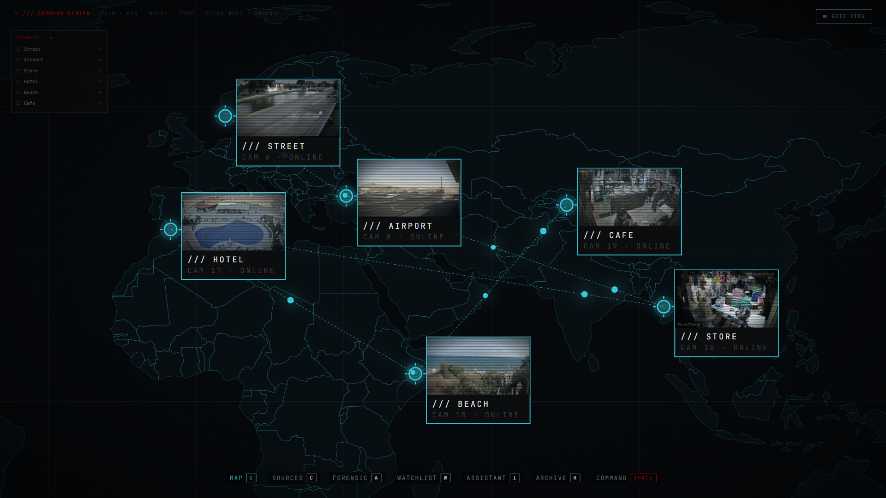

See every camera at once. Their placement, their health, and the paths targets take between neighbouring feeds, drawn live as people move.

### Anomaly and threat reporting


Incidents are ranked by severity and grouped when they repeat. Replay any one of them with an overlay that marks exactly what set it off, next to a written reason for why it matters.

### Live view and image processing


Full resolution live analysis with a "look closer" tool that crops, upscales and sharpens any point in the frame to pull out detail the naked eye, and the detector, would have missed.

### Target tracking

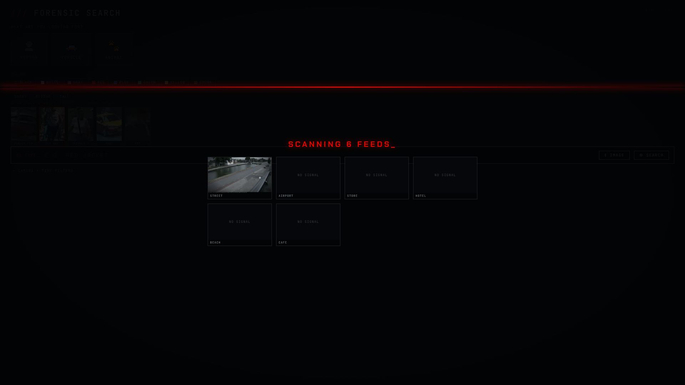

Lock onto any detection for a live target card with its class, attributes and projected path. If the target leaves the frame and returns, overseer re acquires it on its own.

### Vehicle or Person Profile

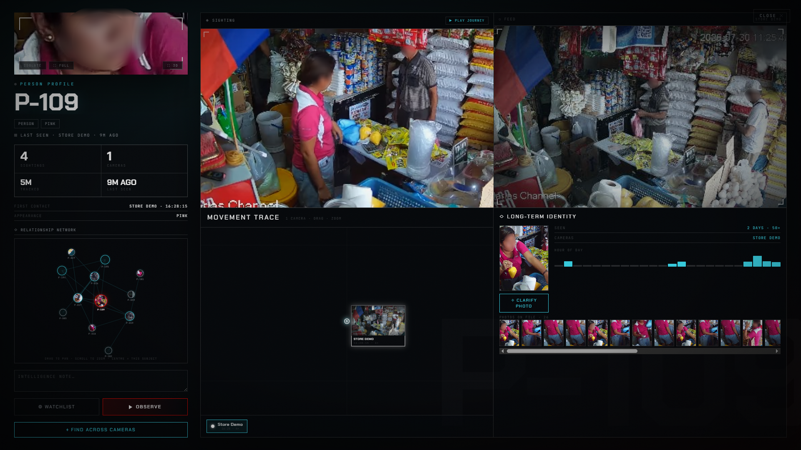

Open any person or vehicle into a full profile: everywhere they were seen on a live map, with a relationship map of who they keep showing up with. Flag them, replay their journey, or reconstruct a sharper photo from their many sightings.

### 3D scene reconstruction


Lift a single camera frame into a navigable 3D scene you can orbit to read depth and layout.

### HoloReel


Capture a few seconds of the scene in 3D and replay it like a video you can fly through. Every frame is precomputed, so it plays back smoothly while you orbit and pause on any moment.

### Social X-ray

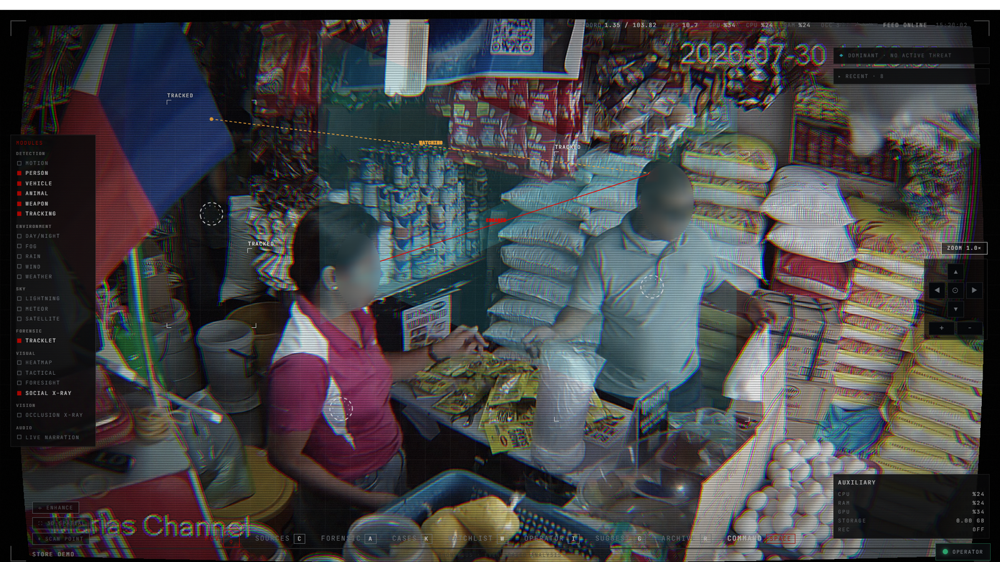

See the hidden social layer of a single camera: each person gets an attention cone showing where they are looking, and people who are interacting are linked as engaged, watching or approaching. Click a person to see only their connections.

### Fog of war

Every other part of overseer answers "what is there". This answers "what could be there that you would never know about". Occluded ground, ground too far away to identify anyone on, regions too dark or blurred to use, and the places where tracks keep quietly dying, all drawn as static over the feed and as solid black volumes you can orbit around in 3D. Coverage is reported as a percentage against the EN 62676-4 (DORI) standard, so "is this camera good enough" finally has a number, and a blind spot arrives with a ranked list of what would fix it.

### Dreamstate

The camera learns what this place normally looks like at this hour and marks anything that departs from it, in calibrated sigma. It is not looking for a list of things: it has no idea what a pallet is, only that a wall which has been empty for three weeks is not empty now. Open the console and a draggable wipe puts what the camera remembers next to what is there now, with the difference outlined on both. It reports divergence, never a threat, because it genuinely cannot tell you what happened.

### Grain

Every site has an unwritten choreography: which way people go here, how fast, where they pause. Grain learns it from your own footage and draws it as a slow current across the ground, then gives each person a quiet ring showing how ordinary their movement is for this place. Someone doing individually innocuous things in an arrangement this place has never seen becomes visible. It scores movement only, never appearance, and when it has not seen a spot often enough it says so instead of guessing.

### Eardrum

A camera with no microphone, listening. Drag a box onto a textured surface and overseer reads its vibration from sub-pixel motion in the pixels: machinery imbalance, structural resonance, an impact, a door slamming. Freeze a baseline and a bearing that starts to drift months later shows up as a peak that moved. The measured noise floor is drawn across every spectrum, so you never read something that was not really there.

### Bedrock

The past as a database rather than as video. Every observation becomes a fact carrying its provenance and two independent clocks: when it was true, and when the system came to believe it. Ask questions nobody indexed for, see the answer as a timeline of everything that was true and for how long, and rewind the second clock to see exactly what was knowable at the time. Corrections never delete, so what you used to believe stays visible with a line through it.

### Forensic search

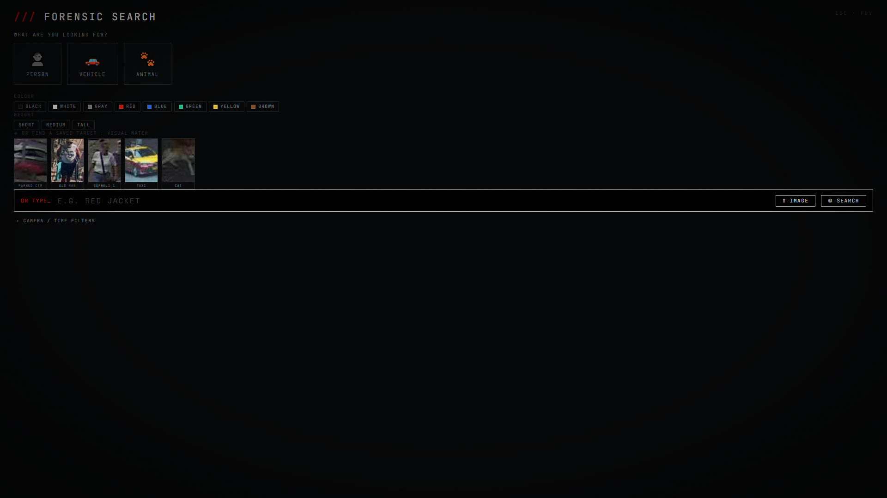

Find anyone by how they look. Colour, height, build, accessories, or an uploaded photo. You get one confident result, not a page of maybes.

### Watchlist and visual match

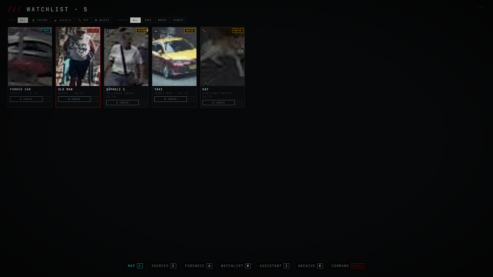

Enrol a person, vehicle or object once, then locate it across every live feed by appearance alone.

### Smart alert rules

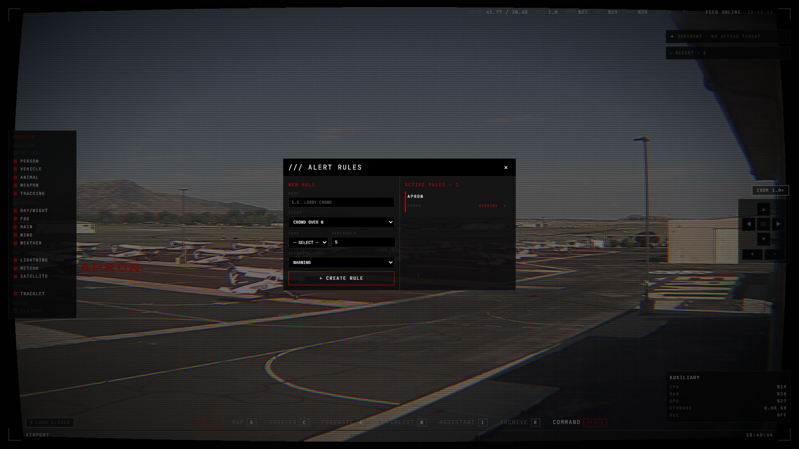

Set rules for zones and behaviour. Restricted area, loitering, crowding, fall, fight, abandoned object, line crossing and more. Or just type the rule in plain language and let the assistant build it for you.

### Smart alert & zone suggestions

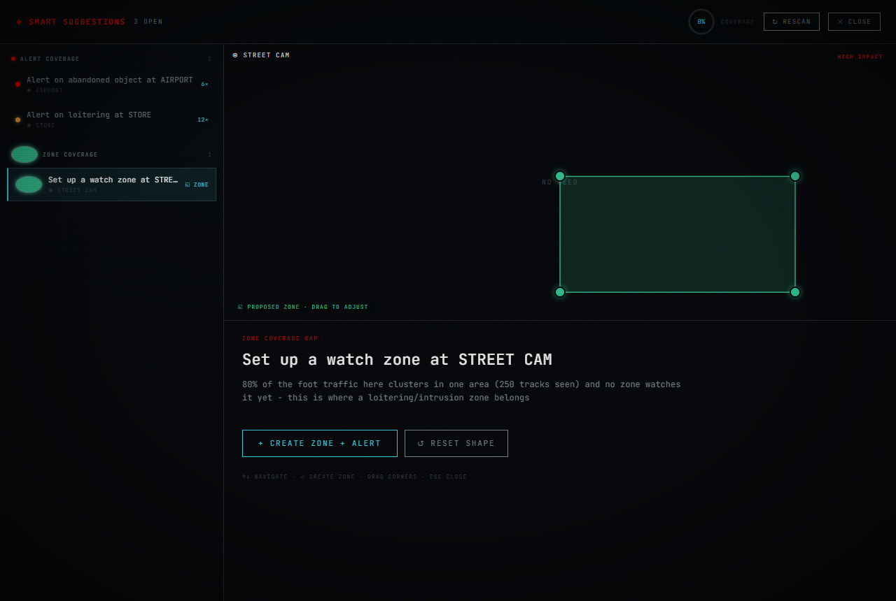

Overseer reads its own record and proposes the coverage you are missing, ranked by impact with the reason written out. Accept a suggestion and the alert rule or watch zone, drawn right on the camera, goes live at once.

### Camera management

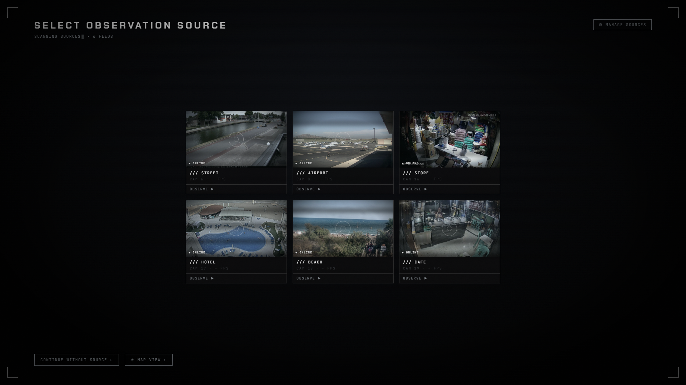

Add and organise sources in seconds. MJPEG, RTSP, RTMP and YouTube live URLs all work out of the box.

### AI Operator

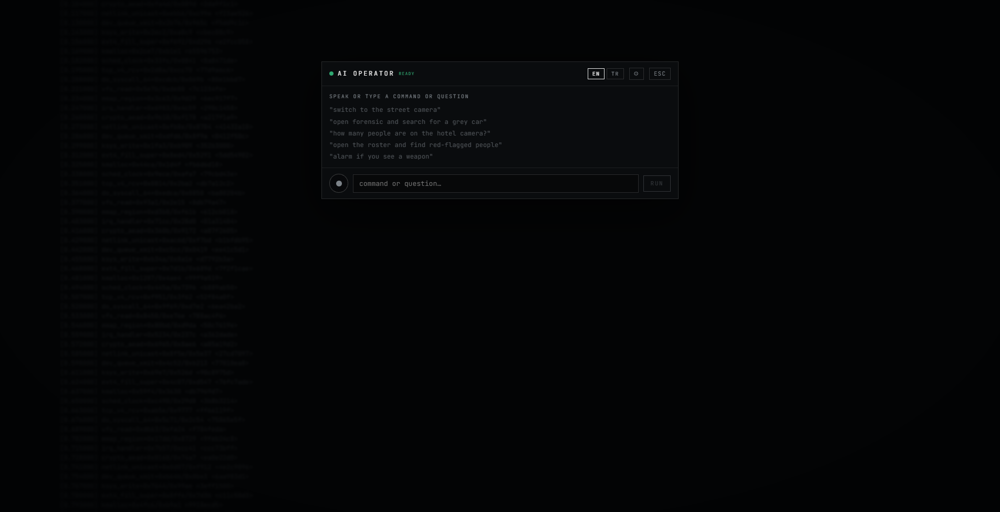

Run the whole app by voice or plain language: switch cameras, search, set alert rules, open the roster, or ask what is on screen. Works with any OpenAI compatible provider in English or Turkish, with a switch for every function and nothing required to run without AI.

## Getting started

Clone the repo, then run the one launcher for your system. It installs everything it needs and opens the app. Sit back.

```bash
git clone https://github.com/emreyvz/overseer.git
cd overseer
```

**Windows**

Double click `overseer.cmd`, or run it from a terminal:

```bat
overseer.cmd
```

**macOS and Linux**

```bash
chmod +x overseer.sh
./overseer.sh
```

The first run installs the Python toolchain on its own, pulls the dependencies, and fetches the vision models, so give it a few minutes. If Node.js is installed it builds and opens the full desktop app. If it is not, it opens in your browser at `http://127.0.0.1:8787` instead. Either way you get the whole thing.

### Prebuilt desktop app

You can also grab a one-click installer from the [latest release](https://github.com/emreyvz/overseer/releases/latest): `Setup.exe` (Windows) or `.AppImage` / `.deb` (Linux). Both install and open with no extra steps.

There is deliberately no macOS download. Apple's Gatekeeper tells anyone who opens an un-notarized `.dmg` that the app *"is damaged and can't be opened"*, which looks like a broken file rather than the policy block it actually is, and clearing it takes a Terminal command. Rather than ship something that greets Mac users with a false error, Overseer asks them to build it locally, where that block does not apply at all. It takes one command and produces the same desktop app: see [Building from source](https://emreyvz.github.io/overseer/docs/building/). Everything the app does is fully supported on macOS, including Apple Silicon.

### Vision models

On the first launch `overseer.cmd` / `overseer.sh` downloads the vision models for you. If a download is skipped or fails the app still runs, just at reduced accuracy, and it says so on each result, so a failed model fetch never crashes anything. You can re-run the fetch at any time:

```bash
uv run python -m match.tools.export_models
```

Most models are fully automatic. Two dedicated re-identification models give the best identity accuracy but are hosted behind Google Drive / release pages, so you download the checkpoint once by hand and the same command converts it. The app already works well without them because the general DINOv2 embedder stands in.

| Model | What it does | How it arrives |
|-------|--------------|----------------|
| YOLO11 detector (`yolo11s.pt`) | Finds people, vehicles, animals, weapons | Automatic (first analysis) |
| YOLO11-seg (`yolo11n-seg.pt`) | Foreground masks for cleaner matching | Automatic |
| DINOv2 ViT-S/14 (`dinov2_vits14.torchscript`) | Generic appearance embedding; also the person/vehicle fallback | Automatic (torch.hub) |
| CLIP ViT-B/32 | Zero-shot vehicle body type (sedan / hatchback / SUV / ...) | Automatic (Hugging Face hub, first vehicle) |
| Whisper `small` | Offline speech-to-text (Turkish + English) for the AI Operator | Automatic (first voice command) |
| EasyOCR | Plate reading (ANPR) for vehicle identity | Automatic with `uv sync --extra ai-extras` |
| OSNet-AIN (`osnet_ain_x1_0.torchscript`) | Dedicated person re-identification | Manual checkpoint, see below |
| VeRi R50-ibn (`veri_sbs_R50-ibn.torchscript`) | Dedicated vehicle re-identification | Manual checkpoint, see below |

**Person re-identification (OSNet-AIN).** Download a cross-domain OSNet-AIN checkpoint from the torchreid model zoo, drop it into `models/`, then run the fetch command to convert it to `models/osnet_ain_x1_0.torchscript`.

- Model zoo: https://github.com/KaiyangZhou/deep-person-reid/blob/master/docs/MODEL_ZOO.md
- Recommended (multi-source, generalizes to unseen cameras): https://drive.google.com/file/d/1nIrszJVYSHf3Ej8-j6DTFdWz8EnO42PB/view

**Vehicle re-identification (VeRi).** Download the fast-reid VeRi model, drop it into `models/`, and convert it. This one needs the fast-reid framework, so clone it and point `FASTREID_ROOT` at it before running the fetch.

- Weights (direct download): https://github.com/JDAI-CV/fast-reid/releases/download/v0.1.1/veri_sbs_R50-ibn.pth
- Framework: `git clone https://github.com/JDAI-CV/fast-reid` then `export FASTREID_ROOT=/path/to/fast-reid`

Model files live under `models/` and are git ignored, so they never bloat the repo.

### Using a YouTube video as a camera

Add a YouTube watch URL as a source and overseer downloads that video once at up to 1080p and plays it start to finish on a loop, like a continuous live feed, running the same detection and tracking on it as on a real camera. It is downloaded a single time and reused, so it never re-streams and never expires. While the video is downloading the camera shows the video's poster and a progress badge.

### Optional AI setup

The assistant stays off until you give it a provider. Copy the template and drop in your key:

```bash
cp config/ai_secret.json.example config/ai_secret.json
```

Then edit `config/ai_secret.json`. It is git ignored and never leaves your machine. Any OpenAI compatible endpoint works, and you can also set it up from the settings panel inside the assistant.

### Developer setup

Working on the code? Run the pieces yourself:

```bash
uv sync                                   # backend and its Python deps
cd web && npm install && npm run build    # build the interface
npm run electron                          # desktop app, or: uv run python -m server for browser mode
```

## Responsible use

overseer is built for defensive awareness, public safety and forensic work. You are fully responsible for how you use it.

- Only point it at cameras and streams you own or are authorised to access.
- Follow every privacy, surveillance and data protection law that applies where you are.
- Never use it to stalk, harass, profile or harm anyone.

The software is provided as is, with no warranty of any kind. The author is not liable for any misuse or for any damage arising from its use.

## Contributing

Issues and pull requests are welcome. Bug reports and focused fixes especially. Open an issue first for anything large, keep to the existing code style, and make sure `uv run pytest` and `npm run build` both stay green before you send it.

## License

Personal use only. You may use and modify overseer for your own personal, non commercial purposes. You may not sell it, sell a modified version of it, or ship it as part of a commercial product or service. See [LICENSE](LICENSE) for the full terms.

For any other permission, or for any complaint, reach the author at [github.com/emreyvz](https://github.com/emreyvz).
