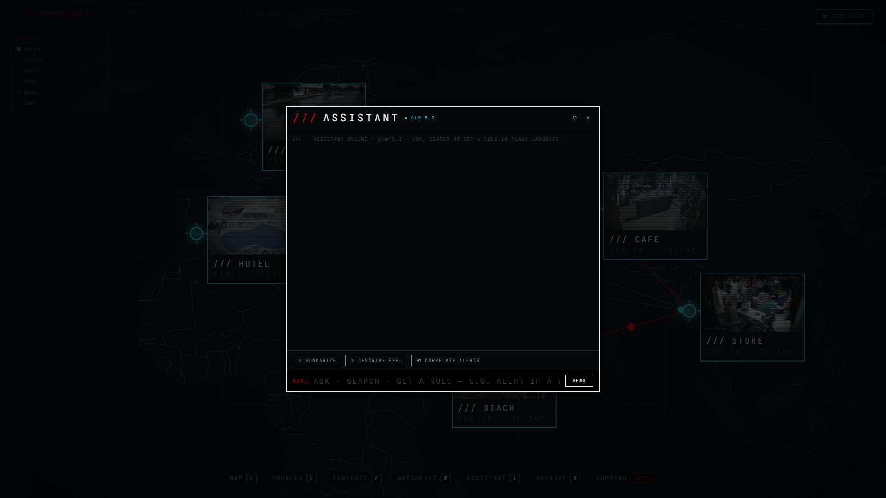

# overseer

**See more. Know sooner. Miss nothing.**

overseer turns any set of cameras into a single real time intelligence operation. It spots people, vehicles, weapons and dangerous behaviour as they happen, follows a target from one camera to the next, and lets you search back through hours of footage just by describing what you are looking for. When something matters, it tells you, and it shows you exactly where to look.


## Features

### Live command center

**[Watch the demo video](demo/initial_map_demo_view.mp4)**

Every camera is a live node on a world map. Watch anonymised movement flow between feeds, drop into any camera with a single click, and run your whole network from one screen.

### Map and cross camera flow


See every camera at once. Their placement, their health, and the paths targets take between neighbouring feeds, drawn live as people move.

### Camera management


Add and organise sources in seconds. MJPEG, RTSP, RTMP and YouTube live URLs all work out of the box.

### Live view and image processing


Full resolution live analysis with a "look closer" tool that crops, upscales and sharpens any point in the frame to pull out detail the naked eye, and the detector, would have missed.

### Target tracking


Lock onto any detection for a live target card with its class, attributes and projected path. If the target leaves the frame and returns, overseer re acquires it on its own.

### Forensic search


Find anyone by how they look. Colour, height, build, accessories, or an uploaded photo. You get one confident result, not a page of maybes.

### Watchlist and visual match


Enrol a person, vehicle or object once, then locate it across every live feed by appearance alone.

### Smart alert rules


Set rules for zones and behaviour. Restricted area, loitering, crowding, fall, fight, abandoned object, line crossing and more. Or just type the rule in plain language and let the assistant build it for you.

### Anomaly and threat reporting


Incidents are ranked by severity and grouped when they repeat. Replay any one of them with an overlay that marks exactly what set it off, next to a written reason for why it matters.

### AI assistant



An optional assistant that works with any OpenAI compatible provider. It runs natural language search, ties related alerts into one incident, writes shift summaries, suggests the next action, and describes a scene on request. Every function has its own switch, and overseer runs perfectly well with no AI configured at all.

## Getting started

Clone the repo, then run the one launcher for your system. It installs everything it needs and opens the app. Sit back.

```bash
git clone https://github.com/emreyvz/overseer.git
cd overseer
```

**Windows**

Double click `overseer.cmd`, or run it from a terminal:

```bat
overseer.cmd
```

**macOS and Linux**

```bash
chmod +x overseer.sh
./overseer.sh
```

The first run installs the Python toolchain on its own and pulls the dependencies, so give it a few minutes. If Node.js is installed it builds and opens the full desktop app. If it is not, it opens in your browser at `http://127.0.0.1:8787` instead. Either way you get the whole thing.

### Optional AI setup

The assistant stays off until you give it a provider. Copy the template and drop in your key:

```bash
cp config/ai_secret.json.example config/ai_secret.json
```

Then edit `config/ai_secret.json`. It is git ignored and never leaves your machine. Any OpenAI compatible endpoint works, and you can also set it up from the settings panel inside the assistant.

### Developer setup

Working on the code? Run the pieces yourself:

```bash
uv sync                                   # backend and its Python deps
cd web && npm install && npm run build    # build the interface
npm run electron                          # desktop app, or: uv run python -m server for browser mode
```

## Responsible use

overseer is built for defensive awareness, public safety and forensic work. You are fully responsible for how you use it.

- Only point it at cameras and streams you own or are authorised to access.
- Follow every privacy, surveillance and data protection law that applies where you are.
- Never use it to stalk, harass, profile or harm anyone.

The software is provided as is, with no warranty of any kind. The author is not liable for any misuse or for any damage arising from its use.

## Contributing

Issues and pull requests are welcome. Bug reports and focused fixes especially. Open an issue first for anything large, keep to the existing code style, and make sure `uv run pytest` and `npm run build` both stay green before you send it.

## License

Personal use only. You may use and modify overseer for your own personal, non commercial purposes. You may not sell it, sell a modified version of it, or ship it as part of a commercial product or service. See [LICENSE](LICENSE) for the full terms.

For any other permission, or for any complaint, reach the author at [github.com/emreyvz](https://github.com/emreyvz).
